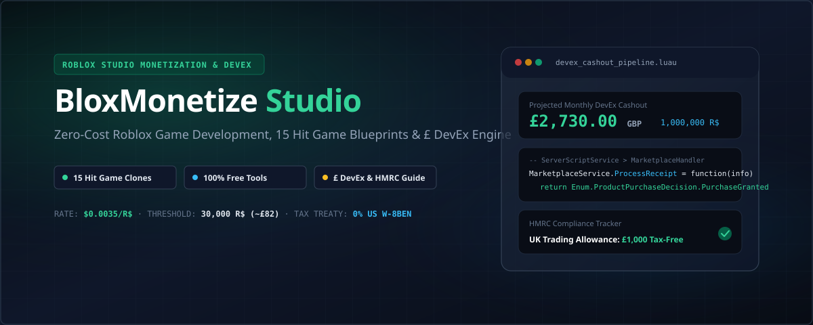

# BloxMonetize Studio



<div align="center">

[](https://create.roblox.com)
[](https://luau.org)
[](https://react.dev)
[](https://tailwindcss.com)
[-10B981?style=flat-square)](https://en.wikipedia.org/wiki/Pound_sterling)
[](LICENSE)

**The comprehensive studio workbench, financial calculator, and developer masterclass for building hit Roblox games for free and exchanging earned Robux into British Pounds (£ GBP).**

[Live Application](#overview) · [15 Hit Game Blueprints](#15-hit-game-deconstructions) · [£ DevEx Engine](#devex-financial-pipeline) · [Luau Script Library](#production-luau-script-library) · [UK Tax Checklist](#uk-hmrc-self-assessment-checklist)

</div>

---

## 📖 Overview

**BloxMonetize Studio** is an all-in-one developer accelerator designed for solo game creators and indie studios building experiences on Roblox. It breaks down the entire lifecycle of conceptualizing, programming, monetizing, and cashing out from Roblox:

1. **How to build front-page games for 100% free** using open-source tools (Blender, Kenney, Quaternius, Photopea).
2. **Deconstructions of 15 viral Roblox hits** (*Fisch, Blade Ball, Steal An Egg, a dusty trip, Blue Lock: Rivals, Muscle Legends, Murderers VS Sheriffs, Build a base RNG*, etc.) with step-by-step solo build instructions and ready-to-run AI prompts.
3. **Send prompts to Arena.ai/agent** with one click to generate working code and prototype mechanics.
4. **Developer Exchange (DevEx) to British Pounds (£ GBP) Calculator** grounded in the official fixed rate of **$0.0035 USD per Earned Robux**.
5. **DAU & ARPDAU Revenue Simulator** to forecast 30-day monthly earnings based on player traffic.
6. **Server-Authoritative Luau Script Library** for GamePass checking, bulletproof DataStore saving with `BindToClose`, idempotent `ProcessReceipt` handling, and daily login retention escalators.
7. **UK Tax & HMRC Compliance Playbook** with Form W-8BEN guidance (0% US withholding tax via Treaty Article 12) and an interactive 10-step Self-Assessment checklist.

---

## 🚀 Key Features

### 1. 🎮 15 Hit Game Deconstructions & AI Prompts
Deconstructs the exact mechanical architecture, free tech stack, solo development steps, and monetization models for 15 top Roblox genres:
- **Fisch**: Smooth water raycasting, UI oscillation reel bar minigame (`math.sin`), fish weight and mutation tables, dock merchant selling loop.
- **Steal An Egg / Steal a Brainrot**: Base plots, `ProximityPrompt` pedestal theft, back-welding with movement speed penalties, base return banking, and alarm triggers.
- **Blade Ball**: Homing sphere physics, deflection timing window within 15 studs, speed compounding (+10% per hit), and clash particle VFX.
- **a dusty trip / Build A Plane**: Modular vehicle chassis, scavenging parts with `WeldConstraint`, fuel jerry can fluid transfer, and procedural desert road chunk generation.
- **Blue Lock: Rivals**: Physics soccer ball dribbling, upward curve shots using `AssemblyLinearVelocity`, trait ability rolls, and awakening flow state.
- **Grow a Garden / Grow a Chicken Fighter**: Soil tile farming, `TweenService` plant scaling, watering can timers, and rooster fighter breeding.
- **Merge a Nuke!**: 2048 physics dropper, identical collision tier fusing, uranium energy points, and Tsar Bomba orbital launch cutscenes.
- **Muscle Legends**: Dumbbell workout tool, character avatar proportional resizing (`BodyHeightScale`, `BodyWidthScale`), and fight pit arenas.
- **Build a base RNG (Sol's RNG style)**: Weighted probability tables (1/2 Common up to 1/1,000,000 Cosmic), neon aura billboard particles, and base luck totems.
- **Murderers VS Sheriffs / Baddies**: Hitscan revolver raycasting, projectile throwing knives, headshot multipliers, and killstreak feeds.
- **1-Click Arena.ai/agent Integration**: Direct button to launch prompts in [Arena.ai/agent](https://arena.ai/agent) with the full prompt automatically copied to your clipboard.

### 2. 💷 DevEx to British Pounds (£ GBP) Cashout Engine
- **Fixed DevEx Exchange Rate**: `$0.0035 USD per 1 Earned Robux`.
- **Minimum Cashout Threshold**: `30,000 Earned Robux` ($105.00 USD / ~£82.00 GBP).
- **Platform Fee Calculator**: Models Roblox's 30% marketplace fee (you receive 70% Net Earned Robux).
- **UK Take-Home Estimator**: Applies the UK HMRC £1,000 Trading Allowance and estimates basic rate income tax.
- **DevEx Quick Milestone Benchmarks**:
  - `30,000 R$` = $105.00 USD = **~£81.90 GBP**
  - `100,000 R$` = $350.00 USD = **~£273.00 GBP**
  - `500,000 R$` = $1,750.00 USD = **~£1,365.00 GBP**
  - `1,000,000 R$` = $3,500.00 USD = **~£2,730.00 GBP**
  - `5,000,000 R$` = $17,500.00 USD = **~£13,650.00 GBP**
  - `10,000,000 R$` = $35,000.00 USD = **~£27,300.00 GBP**

### 3. 📈 DAU & ARPDAU Economy Revenue Simulator
- **Dual Forecasting Modes**:
  - **DAU & ARPDAU Engine**: Calculates projected monthly earnings using the industry studio formula:
    $$\text{Monthly DevEx (\pounds)} = \text{DAU} \times \text{ARPDAU (in R\$)} \times 30 \times 0.70 \times \$0.0035 \times \text{Exchange Rate}$$
  - **CCU Spender Funnel**: Models concurrent players (CCU), daily turnover ratio, spender conversion rate (1.5%–4%), and Roblox Premium engagement hours.
- **Genre ARPDAU Benchmarks**:
  - Casual Obby / Tower: `0.15 R$`
  - Base Tycoon / Merger: `0.55 R$`
  - Pet / Incremental Simulator: `1.25 R$`
  - Anime RPG / High Spender Gacha: `2.80 R$`

### 4. 📜 Production Luau Script Library
Pre-made, modular, server-authoritative scripts ready to paste into Roblox Studio:
- **`GamePass Purchase Checks & Live Perks Handler`**: Safe `UserOwnsGamePassAsync` check with session caching, character respawn perk applicator, and real-time `PromptGamePassPurchaseFinished` mid-game purchase handler.
- **`Bulletproof Production DataStore Saving System`**: Implements `DataStoreService:UpdateAsync`, 5-minute background auto-saving, default data reconciliation, and `game:BindToClose` shutdown protection to prevent data wipes.
- **`MarketplaceService.ProcessReceipt`**: Idempotent developer product receipt processor storing transaction IDs to prevent double-spending.
- **`Daily Login Streak & Multiplier System`**: Server-side `os.time()` comparison for 7-day retention escalators.
- **`ZonePlus SafeZone & Anti-Grief Protection`**: Boundary validation disabling PvP combat inside designated safe regions.

### 5. 🇬🇧 UK HMRC Self-Assessment Checklist & Playbook
- **Interactive 10-Step Compliance Tracker**: Tracks progress with persistent `localStorage` saving.
- **IRS Form W-8BEN Guide**: Explains how to complete Part II (Treaty Benefits) claiming **Article 12 (Royalties)** to reduce US withholding tax from **30% down to 0%**.
- **Tipalti Onboarding**: Steps for setting up direct BACS/Wire bank deposits to UK accounts (Monzo, Barclays, HSBC, Starling) to avoid PayPal's 4% foreign exchange markup.
- **Allowable Expense Deductions**: Guidance on deducting PC components, Blender plugins, sound effects, and Roblox Ads.

---

## 🛠️ Zero-Cost Development Pipeline

You can build complete, high-quality games without spending a penny:

| Category | Recommended Free Tool | Purpose |
| :--- | :--- | :--- |
| **Engine & Hosting** | [Roblox Studio](https://create.roblox.com) | Free 3D engine, IDE, and multiplayer cloud hosting |
| **3D Modeling** | [Blender](https://www.blender.org) | Open-source 3D modeling, rigging, and animation |
| **UI & Graphics** | [Photopea](https://www.photopea.com) | Free browser-based Photoshop alternative for thumbnails and UI |
| **Public Domain 3D** | [Kenney.nl](https://kenney.nl/assets) | 1,000+ CC0 public domain 3D models (fish, cars, tools) |
| **Character Meshes** | [Quaternius](https://quaternius.com) | Free CC0 rigged low-poly character and vehicle packs |
| **Licensed Audio** | Roblox Creator Store | 100,000+ free licensed APM tracks and sound effects |
| **Data Persistence** | ProfileService (GitHub) | Industry standard session-locking DataStore framework |

---

## 💻 Getting Started Locally

### Prerequisites
- [Node.js](https://nodejs.org) (v18 or higher recommended)
- `npm` or `bun`

### Installation
```bash
# Clone the repository
git clone https://github.com/your-username/bloxmonetize-studio.git
cd bloxmonetize-studio

# Install dependencies
npm install

# Start the development server
npm run dev
```

Visit `http://localhost:3000` in your web browser.

---

## 📊 The DevEx Formula Reference

```
Gross In-Game Sales (100%)
         │
         ▼  (Roblox takes 30% Marketplace Fee)
Net Earned Robux (70%)
         │
         ▼  (Minimum 30,000 Robux required)
DevEx Cashout ($0.0035 USD per Robux)
         │
         ▼  (Form W-8BEN UK Treaty Article 12: 0% US Tax)
100% Payout Dispatched via Tipalti
         │
         ▼  (Wholesale FX Conversion: $1 = ~£0.78)
Direct Deposit into UK Bank Account in British Pounds (£ GBP)
```

---

## 📄 License

This project is licensed under the [MIT License](LICENSE).

---

<div align="center">
Built for Roblox creators worldwide. Start building, retain your players, and scale your DevEx earnings!
</div>
